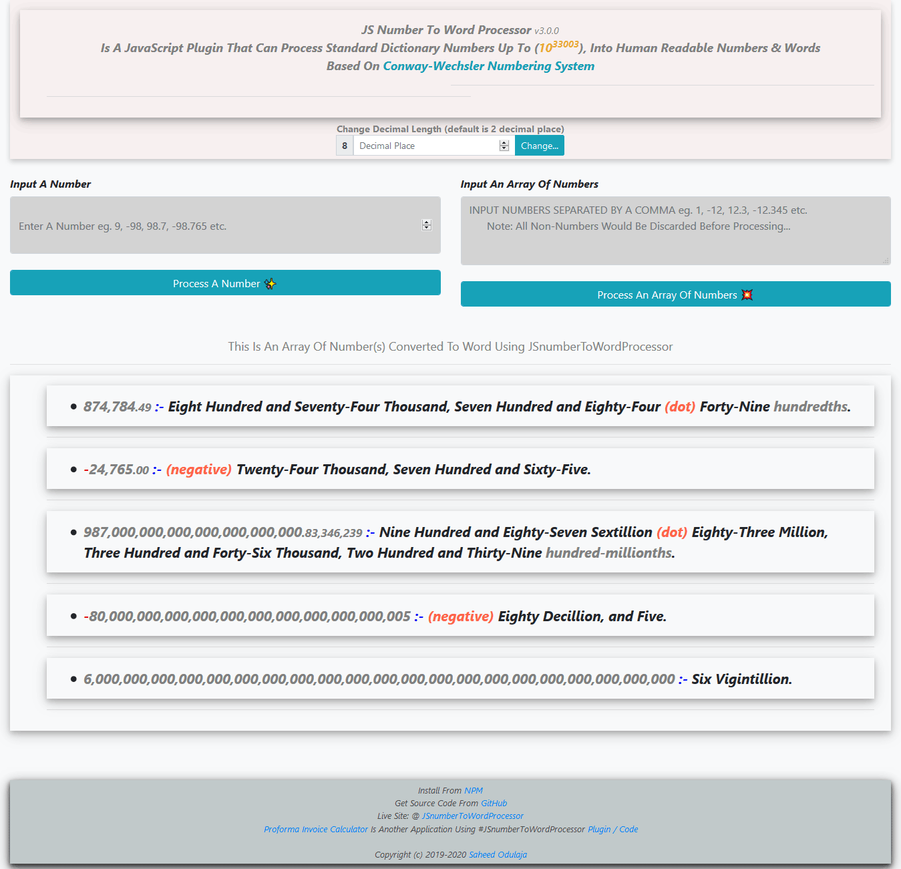

JavaScript Number To Word Processor
=====================================

<h1 align="center">
  
  
</h1>

<h4 align="center"><code> 123,456,789,012,345,680 </code> => <code>One Hundred and Tweenty-Three Quadrillion, Four Hundred and Fifty-Six Trillion, Seven Hundred and Eighty-Nine Billion, and Twelve Million, Three Hundred and Fourty-Five Thousand, Six Hundred and Eighty.</code></h4>

<blockquote align="center">
    The Goal Of <em>JavaScript Number To Word Processor</em> Is A Well Formartted <code> Number </code> With A Corresponding <code> Number Words </code> That's Easily Readable To The Eyes
</blockquote>

# How To Use Plugin In Your Project:
- 1). Download And Attach The JSnumberToWordProcessor.js Script To Your Document.
- 2). From Your Project Script, Call JSnumberToWordProcessor(numInput), Where numInput is Either A Number Or An Array Of Numbers.
-     a). e.g JSnumberToWordProcessor(123456) OR JSnumberToWordProcessor([123,445,6,8575,8474]).
-     b). OR Just Check JSnumberToWordProcessor.html to See How It Is Been Put To Use.
- 3). Display The Result To Your Document.

Test Plugin @ [JavaScript Number To Word Processor](https://sidodus.github.io/JavaScript-Number-To-Word-Processor/)

Coding Excercise By Saheed Odulaja
> JavaScript Number To Word Processor Is Developedd By Saheed Odulaja As A JavaScript Coding Exercise.
> Feel Free To Fork This Repository as There Is Always Room For Improvement.
> Also Be Kind Enought To Leave A STAR As A Mark Of Encouragement :)
