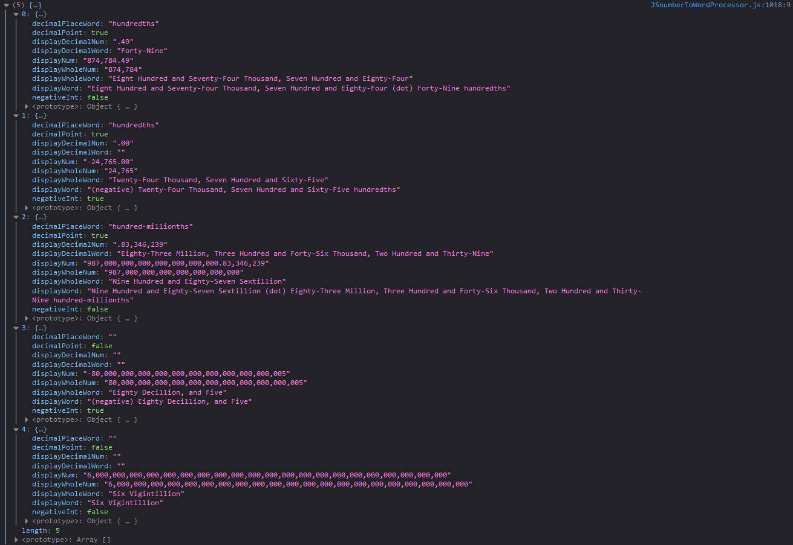

<h1 align= "center"><ins>JavaScript Number To Word Processor</ins>
<h6 align= "center" style="color: grey"><small>... #JSnumberToWordProcessor ...</small></h6></h1> <br />

<div align="center">
  <a href="JSnumberToWordProcessor-fullpage.png" target="_blank" style="margin-right: 5px"></a>
  <a href="JSnumberToWordProcessor-console.PNG" target="_blank"></a>
</div>

<h4 align="center"><code> 123,456,789,012,345,680 </code> => <code>One Hundred and Twenty-Three Quadrillion, Four Hundred and Fifty-Six Trillion, Seven Hundred and Eighty-Nine Billion, and Twelve Million, Three Hundred and Forty-Five Thousand, Six Hundred and Eighty.</code></h4>

<blockquote align="center">
    The Goal Of <em>JSnumberToWordProcessor</em> Is A Well Formatted Human Readable <code> Number, </code> With It's Corresponding <code> Words. </code>
</blockquote>
<blockquote align="center">
    <em>JSnumberToWordProcessor</em> Is A Pure Vanilla JavaScript Plugin With No Dependencies.
</blockquote>

## Setup In Project

HTML Script

```html
<script src="path/to/JavaScript-Number-To-Word-Processor"></script>
```

## Installation

```sh
npm i js-number-to-word-processor
```

ES5 module:

```js
const JSnumberToWordProcessor = require("js-number-to-word-processor");
```

ES6 module:

```js
import JSnumberToWordProcessor from "js-number-to-word-processor";
```

AMD loader libraries such as requireJS::

```js
require(["js-number-to-word-processor"], function (num) {
  // Use JSnumberToWordProcessor here in local scope.
});
```

Use In Project:

```js
// Call JSnumberToWordProcessor & Pass In Either A Positive Whole Number-String
const processeNumber = JSnumberToWordProcessor("987");

// OR An Array Of Positive Whole Number-Strings
const processeNumberArr = JSnumberToWordProcessor([
  "6478",
  "579",
  "57682587698017236587695780",
]);

// Use The Result In Your Project
console.log("processeNumber:- ", processeNumber);
console.log("processeNumberArr:- ", processeNumberArr);
```

<div>
      <h3 align="center"> How To Use JSnumberToWordProcessor Plugin In Your Project </h3>
      <ul>
          <li>Install JSnumberToWordProcessor Plugin Using "npm i js-number-to-word-processor" Without Quotes From CLI & "import" / "require" (JSnumberToWordProcessor) In Your Document</li>
          OR
          <li>Download, And Attach The curStrLengthFunc_2.min.js & JSnumberToWordProcessor.js Script To Your HTML Document.</li>
          <li>From Your Project, Call JSnumberToWordProcessor(numInput); <br /> 
           Where (numInput) is Either A String Of Positive Whole Number, Or An Array Of Positive Whole Number-Strings.
            <ol type="a">
              <li>
                <b style="color: grey;"><i>e.g.</i></b> <br />
                JSnumberToWordProcessor('123456') <br />
                                  OR <br />
                JSnumberToWordProcessor(['123', '445', '6', '8575', '84974']). <br />
                    Ensure You Pass in The Number Argument As A String. <br />
                    This Is Because JavaScript Has A Number Length Limit Of 2^53-1. <br />
                    But If You Would Be Dealing With Numbers Less Than 2^53-1 Length, <br />
                    Then Feel Free To Input A Number As Your Argument.
              </li>
              <li>
                <b style="color: grey;"><i>Alternatively;</i></b> <br />
                    Just Append (n) to The End Of The Number Longer Than 2^53-1 <br />
                    e.g. <br />
                        123456789098765432n <br />
                                 OR <br />
                        [123456789098765433n, 123456789098765434n, 123456789098765434n]. <br />
                    This Calls The BigInt() Method Which Allows JavaScript To Handle BIG Numbers. <br />
              </li>
              <li>
              <b style="color: grey;"><i>NOTE: </i></b> <br />
                    Only Positive Whole Numbers Are Processed. Negative Numbers, With Fractions Would Be Discarded. <br />
              </li>
              <li>
              <b style="color: grey;"><i>Better Still; </i></b> <br />
                    Just Check JSnumberToWordProcessor's index.html  <br />
                    & See How It's Been Put To Use
                    <br />
                    OR
                    <br />
                    Check <a href="https://sidodus.github.io/Sidodus-proforma-invoice-calculator/">Proforma Invoice Calculator</a> To See JSnumberToWordProcessor At Work  <br />
                    Proforma Invoice Calculator <a href="https://github.com/Sidodus-proforma-invoice-calculator/">Source Code</a>
              </li>
            </ol>
          </li>
          <li>
            Display The Result In Your Project.
          </li>
      </ul>
    </div>

<h4><ins>UPDATE</ins></h4>
<h6 margin-bottom="-5px"><em>Version: 2.0.6</em></h6>
  <ol>
    <li> Corrected Read Me Installation Process.</li>
    <li> Code Optimized (for speed).</li> 
  </ol>

<h4><ins>UPDATE</ins></h4>
<h6 margin-bottom="-5px"><em>Version: 2.0.4</em></h6>
  <ol>
    <li> Application Can Now Process Numbers Up To "<code>10^33003</code>", Into Human Readable Numbers & Words Based On <a href="https://www.mrob.com/pub/math/largenum.html" target="_blank"
          >Conway-Wechsler Numbering System</a
        >. </li>
    <li> Optimized Code For Efficiency (Rewrote Most Part). </li>
    <li> Pure Vanilla JS With No Dependencies.</li>
  </ol>

<h4><ins>UPDATE</ins></h4>
<h6 margin-bottom="-5px"><em>Version: 1.1.0</em></h6>
  <ol>
    <li> Application Can Now Handle Numbers Larger Than <code>2^53-1</code> Up To <code>10^126</code>. </li>
    <li> Spelling Errors Corrected. </li>
    <li> Code Refined. </li>
  </ol>

<h6>Install From NPM <a href="https://www.npmjs.com/package/js-number-to-word-processor" target="_blank">NPM</a></h6>
<h6>Get Source Code From <a href="https://github.com/Sidodus/JavaScript-Number-To-Word-Processor" target="_blank">GitHub</a></h6>
<h6>Live Site @ <a href="https://sidodus.github.io/JavaScript-Number-To-Word-Processor/" target="_blank">JSnumberToWordProcessor</a></h6>
<h6><a href="https://sidodus.github.io/Sidodus-proforma-invoice-calculator/" target="_blank">Proforma Invoice Calculator </a>is Another Application Using #JSnumberToWordProcessor <a href="https://github.com/Sidodus-proforma-invoice-calculator/" target="_blank"> Source Code</a></h6>

> JavaScript Number To Word Processor Is Developed By Saheed Odulaja.
> Feel Free To Fork This Repository.
> Also Be Kind Enough To Leave A STAR 🌟 As A Mark Of Encouragement 😃.
